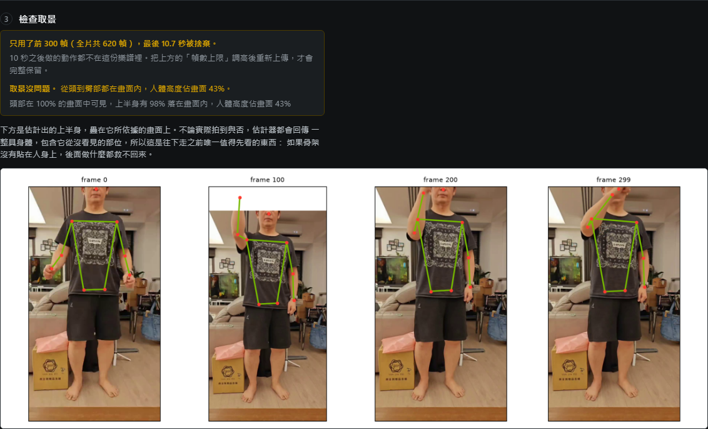

# laban_author

從一段普通影片產生 X1 的新手勢，取代 LabanotationSuite 的 GestureAuthoringTools
原本需要的 Kinect v2。輸入是有人做動作的錄影，輸出是 `laban/` 已經能直接播放的
`PositionN` Labanotation JSON。

```
影片 → SAM3D-Body → 3D 關節 → Labanotation 符號 → 樂譜 → laban/ → X1
        (V2D Track B)          (取自 LabanEditor)
```

## 為什麼不需要深度相機

原本會想到 RealSense D435，是因為原工具用 Kinect。但讀完演算法後問題就變了。

`labanProcessor.coordinate2laban` 是整個「姿態 → Labanotation」的步驟，而它本質是個
**量化器**：肢體方向被歸到 8 個羅盤方位（每格 45 度）與 3 個高度層（每層約 45 度），
加上正上與正下兩個退化情形，整個球面總共只有 27 個符號。

所以姿態來源需要的精度只是**肢體方向準到大約 20 度**，遠低於「關節位置精確到公分」。
這也正好說明 D435 為什麼不划算：深度相機買到的是公制尺度與每像素距離，而公制尺度
恰恰是這條管線丟掉的東西——符號是角度，關鍵幀能量曲線又對每個軸做正規化，所以同一段
錄影不論用公尺或任意單位，輸出都是位元組相同的。

真正決定品質的是**取景**與**左右正確性**，兩者都不是深度問題。

## 驗證

三個檢查，各針對一種可能出錯的方式。

| 檢查 | 指令 | 結果 |
|---|---|---|
| 轉換結果與原工具一致 | `python validate.py` | 6 段錄影、256 個符號全數相同；5/6 份樂譜完全重現 |
| 座標處理對兩種相機都成立 | `python selftest_geometry.py` | 26 個方向在兩種座標慣例下 26/26 復原，且兩者結果一致 |
| 產出能走到機器人 | `python verify_playable.py <score>` | 無手臂關節觸及夾限、無頭部關節觸及限位 |

第六段 `Ges06_chickenwing` 只差在保留了哪些關鍵幀（原本 GUI 可手動增刪），它指名的每一幀
符號都與我們相同。這在 `validate.py` 裡登記為已知差異而非默默容忍：`--strict` 會讓它失敗，
若哪天樂譜檢查在那裡開始通過，就表示當初的假設有問題。

## 使用：編寫網頁

```bash
# 在 cam 上，與 9200 的播放介面並存
bash laban_author/ui/run_ui.sh          # http://<cam>:9300
```

流程是：上傳影片 → 等待估計 → **檢查取景** → 調整關鍵幀 → 存入手勢庫 → 在 X1 上播放。
存進去的手勢庫就是 9200 播放介面所列的那一個，所以編出來的手勢和其他手勢沒有分別。



上圖是「檢查取景」這一步，剛好同時出現兩個判定。綠色那條說取景沒問題：頭部在 100% 的
畫面中可見、上半身 98% 落在畫面內、人體高度佔畫面 43%。橘色那條在它上面，說這段 620 幀
的錄影只用了前 300 幀，最後 10.7 秒被捨棄——也就是下一節的第二個陷阱，實際長什麼樣子。
下方是估計出的上半身疊在它所依據的畫面上，這是往下走之前唯一值得先看的東西。

頁面的切分方式反映成本的分布：估計身體約每秒兩幀、每段錄影只做一次；之後在頁面上改的
任何東西都是從匯出的關鍵點重算，**14 到 16 毫秒**就回來。這是平滑滑桿和點選關鍵幀
感覺像在編輯而不是在重算的原因，也是估計階段寧可寫出 `keypoints.npz` 而不留著 torch
pickle 的原因。

兩件值得特別說的事：

- **取景由工具判斷，不是丟給你。** 估計器不論有沒有拍到都會回傳一整具身體，而且不會抱怨
  ——這正是「沒用的錄影」變成「看起來合理的錯誤樂譜」的那一個失效模式。所以服務會檢查
  估計出的關節落在畫面的哪裡並明說，判定會跟著手勢進到存檔確認訊息裡。
- **播放是借用而非重寫。** 頁面直接從播放端匯入 `GesturePlayer` 與 `GesturePolicy`，
  所以編出的手勢走的是和其他手勢完全相同的路徑：常駐 daemon 在跑時約半秒手臂開始動
  （實測播 `nod` 是 0.53 秒；實際值隨接近斜坡長短而異，頁面回報的是實測而非估計），
  沒跑時另開 `run_player.sh` 約 2.3 秒。

新編的手勢層級是 `unknown`：在有人看著的 `chat` 設定下可播，但排除在由 agent 自行選擇的
`aspire` 之外。這是正確的預設，因為它的自我碰撞間隙還沒被量過。

## 使用：命令列

網頁只是 `pipeline.py` 的薄薄一層，它可以獨立執行：

```bash
python pipeline.py run clip.mp4 --name my_gesture --max-frames 240 \
    --derive-head --save
```

`convert.py` 常用選項：

| | |
|---|---|
| `--derive-head` | 從臉部方向推導頭部符號，而不是寫死 `Forward/Normal` |
| `--acromion` | 上臂起點取肩峰（骨性肩尖）而非肩中心 |
| `--base-rotation first` | 讓軀幹的轉向保留在符號裡，而不是被抵銷掉 |
| `--gauss-window`, `--gauss-sigma` | 挑波峰前手腕運動的平滑程度；越平滑關鍵幀越少 |

## 兩個要注意的陷阱

**取景是最該做對的事。** 測試中唯一真正的失效不在程式：拿一段只拍到軀幹、頭在畫面外的
近距離錄影去跑，全畫面的 bbox 告訴估計器「有一整個人填滿畫面」，它就把一整具身體
擬合到軀幹裁切上——肩膀貼在上緣、鼻子在畫面外、四肢跑到身體外。管線是對的，是輸入不
適合這個任務。可用的錄影要讓人從頭到臀部都入鏡、佔滿畫面大部分、正面對鏡頭。因為這種
失效不會自己出聲，工具現在會出聲：`Job.framing_report` 回傳 `ok`、`head-cropped`、
`partly-cropped`、`too-far`、`too-close` 之一並附上數字。

**幀數上限會安靜地砍掉後半段。** 就是上圖那段 `rhand_move_twist`：20.7 秒的錄影變成
10 秒的樂譜，因為上限把它裁到 300 幀，而且原本只寫在沒人看的 log 裡。那個手勢所有的頭部
動作都發生在 10 秒之後，於是樂譜的頭部欄位全是 `Forward/Normal`，看起來像推導壞了。
裁切比取景不良更糟的一點是：取景不良留下的畫面還在頁面上可以看，裁切則是整段移除，
頁面上再往下也沒有任何線索。所以它現在以自己的顏色排在取景判定的上方。計數取自磁碟上
實際的關鍵點而非 `max_frames`，因為關鍵點不會弄錯到底估了幾幀。

## 目錄

| | |
|---|---|
| `ui/server.py` | 編寫服務：上傳、進度、編輯、存檔、播放 |
| `ui/static/` | 頁面本體，能量曲線的編輯邏輯在 `app.js` |
| `ui/run_ui.sh` | 啟動，並先確認估計器與播放端真的存在 |
| `pipeline.py` | 把一段錄影當成有階段的 job；不需瀏覽器的完整工具 |
| `clip_tools.py` | 需要估計器容器的步驟：探測、裁切、匯出、疊圖 |
| `convert.py` | 關節序列 → 樂譜。LabanEditor `algtotal.py` 的無頭核心 |
| `skeleton.py` | 每個姿態來源都要填的 Kinect 形狀關節記錄 |
| `poses/kinect_csv.py` | 讀原始錄影，存在的目的就是用來對照 |
| `poses/sam3d_body.py` | 讀 `mhr_params.pt`，取代 Kinect 的來源 |
| `make_bbox.py` | `estimate_mhr_params` 硬性要求的 bbox track |
| `validate.py` | 對六份參考樂譜的重現檢查 |
| `selftest_geometry.py` | 合成姿態的座標與手性檢查 |
| `verify_playable.py` | 讓樂譜走過播放端的 decoder 與重定向 |
| `vendor/` | 演算法本體，自 LabanotationSuite 複製。見 `vendor/UPSTREAM.md` |
| `testdata/` | 六段錄影、六份參考樂譜，以及產出的範例 |

`vendor/` 裡的演算法是**複製**而非重寫，這樣產出的符號才會是原工具產出的那些，而不是
一個近似。`vendor/UPSTREAM.md` 記錄每個檔案的來源、雜湊，以及對它做過的唯一一處修改。

## 環境與雜項

- 估計器需要 V2D 的 `v2d_sam3d_body` 映像與權重（`V2D_ROOT`、`SAM3D_WEIGHTS`）。
  批次大小預設 8（`SAM3D_BATCH_SIZE` 可覆寫）——在 RTX PRO 6000 上量測，batch 1 是
  每幀 270 毫秒、batch 8 是 42 毫秒，三種批次的樂譜位元組相同。等待時間大致是
  **18 秒 + 每幀 42 毫秒**。
- `X1_LABAN_DIR` 指向播放端，它同時提供手勢庫與播放器。未設定時會自動探測：先找並排的
  `laban/`（checkout 的樣子），再找 `../teleop_share/laban`（開發樹的樣子）。
- 兩個網頁介面都是繁體中文。階段名稱、取景判定與安全層級在傳輸時維持英文，因為頁面、
  狀態檔、CLI 與 `gesture_policy.py` 都以其為識別碼，只在顯示時翻譯——這樣沒見過的值
  會原樣顯示，而不是被默默對應到錯的東西。疊圖裡的 `frame N` 保持英文是必要的：估計器
  映像裡沒有任何中日韓字型，中文在那裡只會變成豆腐方塊。
- 在 Windows 上編輯這些檔案要注意：本機的編輯工具會寫成系統編碼而非 UTF-8，並曾把繁體字
  默默換成字面的 `?`。含中文的檔案請用明確的 UTF-8 編碼器寫入，並事後檢查編碼有效性、
  沒有 BOM、以及沒有緊鄰中文字的 `?`。