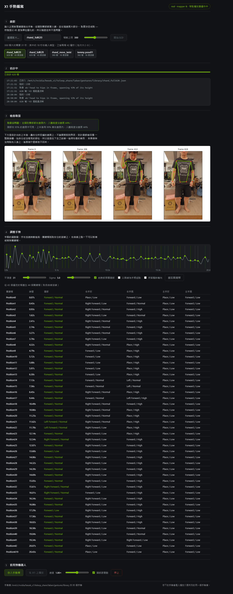
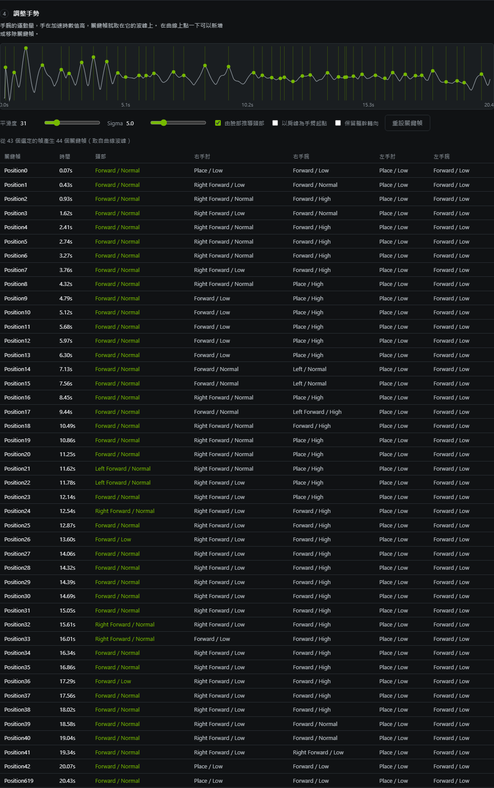
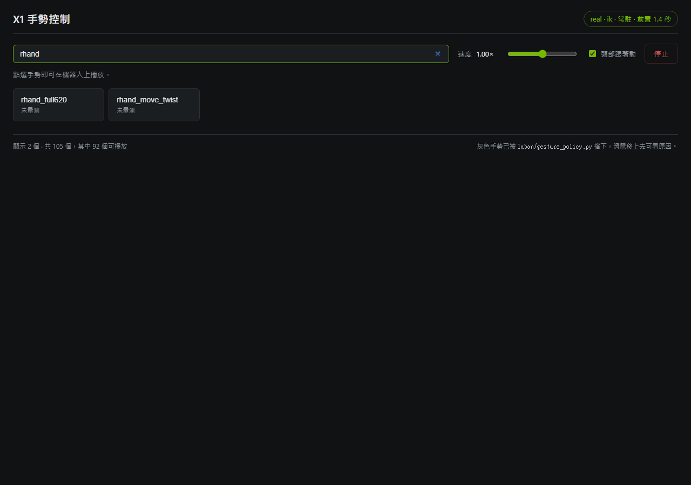
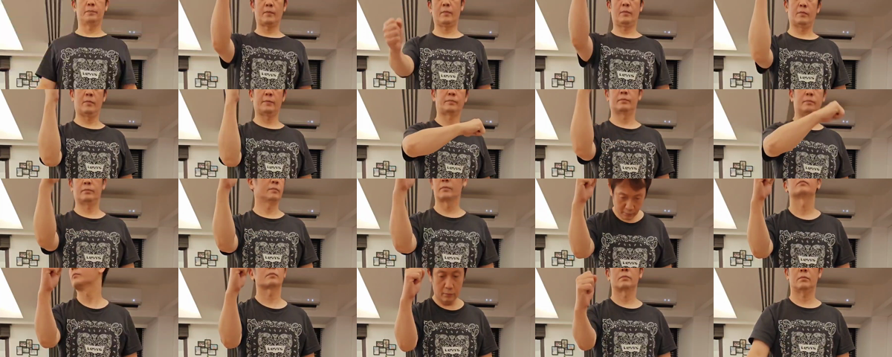
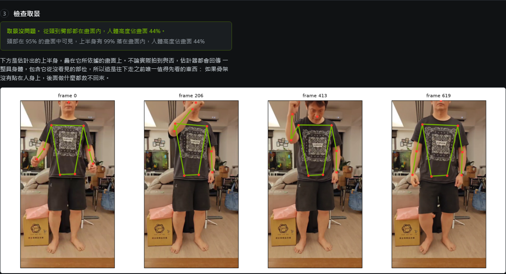

# laban_author

Authoring new X1 gestures from ordinary video, in place of the Kinect v2 that
LabanotationSuite's GestureAuthoringTools needed.

A recording of somebody performing a gesture goes in, and the same
`PositionN` Labanotation json that `laban/` already plays comes out.

```
video -> SAM3D-Body -> 3D joints -> Labanotation symbols -> score -> laban/ -> X1
        (V2D Track B)              (vendored from LabanEditor)
```

## Why the depth camera turned out not to matter

The reason to look at this at all was that the original tool wanted a Kinect,
and that a RealSense D435 was the obvious stand-in. Reading the algorithm
changed the question.

`labanProcessor.coordinate2laban` is the whole of the pose-to-Labanotation
step, and it is a quantiser. A limb direction becomes one of eight compass
directions in 45-degree buckets, and one of three heights in bands about 45
degrees wide, plus a degenerate straight-up and straight-down. Twenty-seven
symbols for the entire sphere.

So the accuracy a pose source has to reach is *a limb direction good to
roughly twenty degrees*, which is a much weaker requirement than
centimetre-accurate joint positions. And that reframes the D435: what a depth
camera buys is metric scale and per-pixel range, and metric scale is precisely
what this pipeline discards. The symbols are angles, and the keyframe energy
curve normalises every axis, so the same recording in metres or in arbitrary
units produces byte-identical output.

That leaves framing and left/right correctness as what actually determines
quality, and neither is a depth problem.

## Verification

Nothing here is trusted because it looks right. Three checks, each aimed at a
different way this could be wrong.

### The conversion reproduces the original tool

`python validate.py`

LabanotationSuite ships six Kinect recordings; `laban/gestures` holds the
scores LabanEditor produced from them. Reading the recordings back and
comparing is an end-to-end check on the reader, the algorithm, the keyframe
selection and the json shape at once.

| | result |
|---|---|
| symbols at every reference keyframe | **6 of 6 gestures, 256 of 256 symbols identical** |
| whole score reproduced exactly | **5 of 6** |

The sixth, `Ges06_chickenwing`, names nine keyframes where the energy curve
peaks eleven times, and no `(window, sigma)` in a 61 x 13 sweep reproduces its
choice. Its symbols agree with ours at every frame it does name, so the
disagreement is only about which frames were kept -- which is what
LabanEditor's right-click add and remove keyframe editing changes. It is
recorded in `validate.py` as a known deviation rather than tolerated silently:
`--strict` fails on it, and if the score check ever starts passing there, the
assumption was wrong.

Two details had to be recovered rather than guessed, and each was confirmed by
the frame counts and timestamps lining up exactly across all six recordings:
the reference scores were produced with gap filling on, and under Python 2,
whose integer division is what makes the timestamps land on exact 33 ms steps.

### The coordinate handling works for either camera

`python selftest_geometry.py`

The recordings above only ever exercise Kinect's axes. Pointing a different
camera at the problem rests on one claim they cannot test: that
`calculate_base_rotation` builds the body frame from a cross product of two
body vectors, so any right-handed source lands on the same (forward, left, up)
basis and no axis remapping is needed.

So this aims limbs at all 26 reachable Labanotation directions, in each
camera's measured convention, and checks the symbols come back as aimed.
**26 of 26 recovered in both, and the two conventions agree on every case.**
If the handedness reasoning were wrong, forward and backward would swap and
this fails loudly rather than producing plausible nonsense.

### The output survives the trip to the robot

`python verify_playable.py testdata/ego_clip_head.json`

Loads a score through the player's own `decoder` and `x1_mapper` and prints the
joint angles. On the test scores no arm joint reaches its clamp and no head
joint reaches its limit, so nothing is being silently saturated.

It also reports what the safety policy thinks. A newly authored gesture is
tier `unknown`, which means playable under the `chat` profile where a human is
watching, and excluded from `aspire` where an agent chooses on its own. That
is the right default: nothing has measured its self-collision clearance yet.

## Pose sources, and which one to use

### SAM3D-Body, via V2D's `v2d_sam3d_body` -- what this is built on

Everything it needs is already on `cam`: 24 of the reconstruction images are
built, and `mhr_params.pt` carries `pred_keypoints_3d` (70 keypoints),
`pred_joint_coords` (the full 127-joint rig) and `pred_global_rots` (a rotation
matrix per joint). Kinect v2 gave 25 joints and no rotations, so this is a
superset of what the original tool had.

It is a SAM 3D Body model on a DINOv3 backbone, with MoGe-2 for monocular
geometry and a field-of-view estimator alongside it: 3.1 GB of weights, and a
32 GB working set on the GPU. Per frame it fits the MHR parametric body to the
image and returns pose, shape, camera and the keypoints this tool reads.

It runs on the GPU, and its default `batch_size=1` still leaves most of the
throughput unclaimed -- the module's own source says the batching is there for
slow CPUs, which is the tell: at one frame at a time the cost is Python
dispatching operators rather than the GPU doing arithmetic. Measured over the
same 90 frames on the RTX PRO 6000:

| batch | wall | inference | gpu | vram |
|---|---|---|---|---|
| 1 | 42.6 s | 270 ms/frame | 64% | 32.1 GB |
| 4 | 22.8 s | 68 ms/frame | 53% | 32.5 GB |
| 8 | 21.5 s | 42 ms/frame | 53% | 32.9 GB |

The scores are byte-identical at all three and the keypoints agree to 1e-6, so
the default here is `batch_size=8` (`SAM3D_BATCH_SIZE` to override). Beyond
that the fixed cost dominates and no batch size helps: loading 3.1 GB of
weights and initialising CUDA is about 18 s whatever comes after it.

So the wait is roughly **18 s plus 42 ms a frame** -- 34 s of estimation for a
13-second recording. The page quotes that from `/api/status` rather than
repeating the numbers. Still record-then-convert rather than a live preview,
but four times closer.

It refuses to run without a bbox track or a SAM2 mask, despite its own argument
parser calling both optional. `make_bbox.py` writes the bbox track directly, so
authoring does not have to pull SAM2 and GroundingDINO into the path.

### MediaPipe Pose -- worth adding for an interactive loop

V2D does ship a `v2d_mediapipe` module, but it only produces hand bounding
boxes; there is no body pose in it. Adding MediaPipe would be a new dependency.

What it would buy is the thing SAM3D-Body cannot give: real-time. Its
`world_landmarks` are metric-ish and hip-centred, and its accuracy is far
better than the twenty degrees this pipeline needs. That makes it the better
fit for the part of authoring that is iterative -- stand in front of a camera,
see the symbols update, adjust the pose. The `poses/` interface exists so a
second source can be added without touching the algorithm: fill the same
Kinect-shaped record and everything downstream is unchanged.

### RealSense D435 -- not recommended for this

There is no RealSense on `cam` right now: no `/dev/video*`, and
`pyrealsense2` is not installed, so this would mean USB passthrough into WSL2
and a driver stack.

More to the point, a D435 does not solve the problem on its own. Depth gives
range per pixel, not joints, so it still needs a 2D pose estimator on top and
the arrangement becomes MediaPipe-plus-depth. What the depth then adds is
metric scale -- which, per the top of this file, is the one thing the
Labanotation quantiser throws away. Better hardware aimed at the wrong
bottleneck.

## Using it: the authoring page

```bash
# on cam, alongside the playback UI on 9200
bash laban_author/ui/run_ui.sh          # http://<cam>:9300
```

Upload a video, watch it estimate, check the framing, shape the gesture, save
it, play it. The library it saves into is the one the playback UI on 9200
lists, so an authored gesture is immediately a gesture like any other.



Step 4 is where the authoring actually happens, and it is worth its own look.
The curve is wrist motion; the dots on it are the keyframes, which default to
its peaks and can be added or removed by clicking. Everything below updates as
you go, so the table is the score you are about to save rather than a report on
one you already did.



Saving puts the gesture in the library the playback page lists, which is the
whole point of sharing one library rather than exporting between two tools: a
gesture authored a minute ago is indistinguishable from the samples that
shipped with the suite, except that it is tier `unknown` until its clearance is
measured.



The page is split the way the cost is. Estimating the body runs at about two
frames a second and happens once per recording; everything the page lets you
change afterwards is recomputed from the exported keypoints in the service
process and comes back in **14 to 16 ms**. That is what makes the smoothing
sliders and the keyframe clicking feel like editing rather than re-rendering,
and it is why the heavy step writes `keypoints.npz` instead of keeping the
torch pickle.

| step | what it does |
|---|---|
| Record | the upload, a frame cap, and an honest estimate of how long the wait will be |
| Estimating | stage-by-stage progress, read out of the estimator's own per-frame counter |
| Check the framing | a verdict, then the estimated skeleton drawn over the frames it came from |
| Shape the gesture | the wrist-motion energy curve with its peaks; click to add or remove a keyframe, or move the smoothing and watch the peaks move |
| Put it on the robot | save into the library, then play through the same resident player everything else uses |

Two things it does that are worth calling out.

**It judges the framing rather than leaving it to you.** The estimator always
returns a whole body, including the parts it never saw, and it does so without
complaint -- which is the one failure that turns a useless recording into a
plausible-looking score. So the service checks where the estimated joints
landed relative to the picture and says so: a nose outside the frame in most
frames means the shoulder line the arm directions are measured against was
extrapolated rather than seen. On the close-up clip described below it reports
`head-cropped, head visible in 0% of frames`, and that verdict follows the
gesture into the save confirmation.

**Playback is borrowed, not reimplemented.** The page imports `GesturePlayer`
and `GesturePolicy` from the playback deployment, so an authored gesture
reaches the arms by exactly the path every other gesture does -- the resident
daemon when it is up, at about 0.7 s from click to arms moving, and a spawned
`run_player.sh` at 2.3 s when it is not. `X1_LABAN_DIR` is the single setting
that points at that deployment, and it supplies both the library and the
player.

### Verified in the browser, not just over the API

`/api/*` is exercised end to end, and separately the page is driven the way a
person drives it: clicking the curve adds a keyframe and draws its marker
(8 rows to 9, logged as picked by hand), clicking it again removes it, dropping
the smoothing to 11 finds 32 peaks where 31 finds 8, returning to 31 gives a
byte-identical score, the head toggle moves the head column from
`Forward/Normal` to `Forward/Low`, and Save then Play lands on the robot via
the daemon. Two bugs came out of doing this rather than assuming:

- The page read `job.framing` through an element id that was never registered,
  so `applyJob` threw inside a promise whose `.catch` was empty and the whole
  editing half of the page silently never appeared. Both halves are fixed: the
  ids are asserted at load, and that `catch` now says what went wrong.
- Clicking Save blurs the name field, which fires a `change`, which schedules a
  rebuild -- so two requests were in flight and whichever answered last decided
  whether Play was enabled. A save could succeed and leave Play greyed out.
  Edits now invalidate the saved state synchronously, at the edit, so the
  ordering is the user's rather than the network's.
- `/api/status` probed the daemon and threw the answer away. One failed socket
  call latches `daemon_ok` off inside the player and it never retries, so every
  later gesture would have quietly paid the 2.3 s spawn. The probe result is
  now assigned, the way the playback UI already did it.

A fourth came from using the tool rather than testing it. Recordings were held
only in memory, on the reasoning that the saved gesture is the durable artefact
and a restart costs only the editing session. Then redeploying the service
dropped a session somebody was in the middle of. Everything expensive is
already in the job directory, so `Job.reopen_all` reads it back at startup:
eight recordings came back in under a second, framing verdicts and all, and
were immediately editable again at 45 ms a rebuild.

## Using it: from the command line

The page is a thin layer over `pipeline.py`, which runs on its own:

```bash
python pipeline.py run clip.mp4 --name my_gesture --max-frames 240 \
    --derive-head --save
```

Or the individual steps, which is what the page calls and what to reach for
when something needs to be inspected in the middle:

```bash
# on cam, where the V2D images and weights are
V2D=$HOME/nvidia/video_to_data
cd $V2D/reconstruction && source .venv/bin/activate

# 1. the bbox track sam3d_body insists on. Full frame by default; pass --box
#    when the performer is off to one side.
docker run --rm -u $(id -u):$(id -g) -v $HOME/laban_author:/author \
    -v $PWD/data/outputs/mine:/work -w /author v2d_sam3d_body \
    python make_bbox.py /work/clip.mp4 -o /work/bbox_track.pt

# 2. estimate the body. Intrinsics are optional; without them a default FOV
#    is used, which is enough for angles.
python -m v2d.sam3d_body.docker.run_estimate_mhr_params \
    --rgb_path data/outputs/mine/clip.mp4 \
    --bbox_path data/outputs/mine/bbox_track.pt \
    --weights_dir data/weights/sam3d_body \
    --output_params_path data/outputs/mine/mhr_params.pt

# 3. convert to a score
docker run --rm -u $(id -u):$(id -g) -v $HOME/laban_author:/author \
    -v $PWD/data/outputs/mine:/work -w /author v2d_sam3d_body \
    python convert.py /work/mhr_params.pt --name my_gesture --fps 30 \
        --derive-head -o /work/my_gesture.json
```

Then drop `my_gesture.json` into `laban/gestures/library/` and it plays like
any other gesture.

Useful options on `convert.py`:

| | |
|---|---|
| `--derive-head` | read the head symbol off the face instead of writing `Forward/Normal` |
| `--acromion` | take the upper arm from the bony shoulder tip rather than the shoulder centre |
| `--base-rotation first` | keep a turn of the torso visible in the symbols instead of cancelling it out |
| `--gauss-window`, `--gauss-sigma` | how much wrist motion is smoothed before peaks are picked; more smoothing gives fewer keyframes |

### The head, which the original tool never derived

LabanEditor wrote `head: [Forward, Normal]` into every keyframe of every score,
hardcoded, and the same for `rotation`. It never looked at the recording.

`--derive-head` reads it instead, from the direction the face points -- out of
the face, from the midpoint of the ears to the nose -- put through the same
quantiser as the limbs. The semantics line up with what the player already
does: `x1_mapper.map_head` reads the direction as yaw and the level as pitch,
and a level gaze quantises to exactly `Forward/Normal`. So this widens the
original behaviour rather than replacing it, and X1's two head joints finally
get something recorded rather than a constant.

It needs a pose source with a face in it, so it is unavailable for the Kinect
recordings, which have no ear keypoints.

It also survives a good deal more cropping than seems reasonable. On
`rhand_move_twist` the estimator places the eyes *above* the top edge of the
picture in 91% of frames -- the top of the skull is simply not in shot -- and
the derived head still tracks: `Forward/Low` at 13.6 s and 17.3 s, which are
the two moments the performer looks down, and `Left Forward` then `Right
Forward` across the turn at 11.6-12.5 s. Checked frame by frame against the
video rather than assumed. So a clipped skull is not a reason to re-record, and
the framing check was deliberately *not* tightened to complain about it: the
one recording it would have newly failed is the one this file holds up as
correctly framed.



## Framing is the thing to get right

The one real failure found while testing was not in the code. Running the
pipeline on `v2d_x1/_ego/v2d_tommy_test_01.mp4`, a close-up of somebody
handling a bottle, produced a badly wrong estimate: shoulders pinned to the top
edge, nose off-image, limbs outside the body. The clip has the head out of
frame and only the torso visible, and a full-frame bbox told the estimator that
a whole person filled it, so it fitted a whole body to a torso crop.

The pipeline was right and the input was wrong for the task. A usable
recording has the performer from head to hips in frame, filling most of it,
facing the camera. That is also the framing the 45-degree quantiser needs least
help with -- get the framing right and the precision takes care of itself.

Because this is the failure that does not announce itself, the tool now
announces it: `Job.framing_report` measures where the estimated joints fell
relative to the picture and returns one of `ok`, `head-cropped`,
`partly-cropped`, `too-far` or `too-close`, with the numbers behind it. On the
bottle clip it reports `head-cropped`, head visible in 0% of frames, upper body
51% inside the frame. Saving is still allowed, since only the person who made
the recording knows whether a torso-only gesture is what they meant, but the
verdict is repeated in the save confirmation rather than forgotten.

### The frame cap, which was the failure that actually bit

Framing is the loud problem. The quiet one is length. `rhand_move_twist` was a
20.7 s recording that became a 10 s score, because the frame cap trimmed it to
300 frames and said so only in a log line nobody reads. Every head movement in
that gesture happened after the 10 s mark, so the score's head column was
uniformly `Forward/Normal` and looked like a broken derivation. It took
re-running the whole 620 frames -- which produces four distinct head symbols --
to establish that nothing was broken except the length.

A trim is worse than bad framing in one specific way: bad framing degrades
frames that are still on the page to look at, whereas a trim removes them
entirely, and nothing further down the page can hint they were ever there. So
it now leads the verdict box, in its own colour, above the framing it is more
important than.


The count comes from the keypoints on disk rather than from `max_frames`, and
that distinction is load-bearing: recordings made before the cap was persisted
default to 300, and the first version of this check used that default to
declare `tommy pose01` -- a 392-frame job that was never trimmed -- short by
3.1 s. The keypoints cannot be wrong about how many frames were estimated, so
they are what is counted, recomputed on every reopen rather than trusted from
a previous run's guess.

### The name field, which was how the frame cap got a second chance

The trim warning above was built after a 20.7 s recording came out as a 10 s
score. Re-running it at 620 frames produced a score with four distinct head
symbols, saved as `rhand_full620` -- and it still played with a motionless head.
The score was fine; the file was not. `rhand_full620.json` in the library was
byte-for-byte the 300-frame score, differing only in the three characters of its
name.

The name field filled itself in only when it was empty, so it kept whatever it
was first given while the selection moved on beneath it. Landing on the newest
recording, then clicking an older one in the list, left the page showing one
recording's curve and table under another's name, and Save believed the field.
Each recording now carries its own name, keyed by job id, so switching always
shows the name belonging to what is selected; typing still overrides, but only
for the recording it was typed for.

Worth saying plainly, because it is the second time in this file: the failure
was not in the derivation. Both times the derivation was right and something
around it -- a silent trim, then a stale text field -- made it look broken, and
both times the fix was to make the surrounding state impossible to misread
rather than to change any geometry.

A third instance of the same shape turned up while checking the translation.
`elapsed_s` was persisted as a duration and recomputed on reopen against the
wall clock, so a job read back the next day reported 21 hours of estimation --
and once written, that was what the next reopen read and rewrote. It now
persists the absolute `finished` stamp and derives the duration from it, and
records written before that stamp existed get `None`, which the page renders as
nothing rather than as a confident wrong number.

### Language

Both interfaces are Traditional Chinese: this tool at `ui/` and the playback
page in `teleop_share/laban/ui/`. Stage names, framing verdicts and policy tiers
stay English on the wire, because the pages, the state file, the CLI and
`gesture_policy.py` all key off them, and are translated at the edge -- which
also means an unrecognised value shows up as itself instead of being silently
mapped to something wrong. `gesture_policy.py` is shared with the autonomous
stack and was not touched; the reasons it generates are matched and rewritten in
the playback page.

Two labels stay English by necessity. The frame captions in the overlay are
drawn by matplotlib inside the estimator image, which carries no CJK font at all
-- its default DejaVu Sans has no glyph for U+624B -- so Chinese there would
render as tofu. The frame numbers are ASCII anyway, and the caption that was
above them is gone, since the page states the same thing in Chinese directly
above the picture.

One thing to know when editing these files on Windows: the editing tools here
write the system codepage, not UTF-8, and silently replaced Traditional
characters with literal `?` in several strings before this was caught. Every
file with Chinese in it was written through an explicit UTF-8 encoder instead,
and all seven were checked afterwards for valid UTF-8, absence of a BOM, and any
`?` adjacent to a CJK character.

### A properly framed recording, end to end

`laban_tommy_pose01.mp4` is the first recording made for this: somebody
standing back from a phone, full body in frame, raising both arms and lowering
them again. 392 frames, 13.1 s, portrait 720x1280.

The verdict is `ok` -- head visible in 87% of frames, upper body 96% inside the
frame, body spanning 40% of its height. The top of the skull is clipped by the
upper edge and it does not matter, because what the arm directions are measured
against is the shoulder line, and the check asks whether the *nose* was seen
rather than the whole head.



The whole job takes 42 s, of which about 34 s is estimation -- it was 136 s
before the batch size was measured rather than left at its default, and the
score is byte-identical across that change. The energy curve
peaks 16 times, once per arm raise, and the score has the variety a gesture
should have: `Place/Low` elbows with `Forward/Low` wrists at rest, up through
`Right Forward/Low` elbows and `Forward/High` wrists at the top of each raise,
alternating sides, and back to rest on the last keyframe. Five distinct
directions per elbow across 17 keyframes.

Retargeted, no arm joint reaches the clamp and no head joint reaches its limit,
and it plays on X1 through the resident daemon in 15.4 s.

Two honest observations from it. The head symbol is `Forward/Normal` on all 17
keyframes, because the performer looked level at the camera the whole time --
correct rather than broken, and the counterpart to the cropped clip reading
`Forward/Low`. And 12.9 s is long for a gesture; the frame cap and hand-picked
keyframes are how to cut it down.

## Layout

| | |
|---|---|
| `ui/server.py` | the authoring service: upload, progress, edit, save, play |
| `ui/static/` | the page. `app.js` holds the energy-curve editing |
| `ui/run_ui.sh` | starts it, after checking the estimator and the playback deployment are actually there |
| `pipeline.py` | a recording as a job with stages; the whole tool without a browser |
| `clip_tools.py` | the steps needing the estimator's container: probe, trim, export, overlay |
| `convert.py` | joint frames to a score. The headless core of LabanEditor's `algtotal.py` |
| `skeleton.py` | the Kinect-shaped joint record every pose source fills |
| `poses/kinect_csv.py` | reads the original recordings; exists to be checked against |
| `poses/sam3d_body.py` | reads `mhr_params.pt`; the source that replaces the Kinect |
| `make_bbox.py` | the bbox track `estimate_mhr_params` requires |
| `validate.py` | reproduction check against the six reference scores |
| `selftest_geometry.py` | coordinate and handedness check on synthetic poses |
| `verify_playable.py` | a score through the player's decoder and retarget |
| `vendor/` | the algorithm itself, copied from LabanotationSuite. See `vendor/UPSTREAM.md` |
| `testdata/` | the six recordings, the six reference scores, and produced examples |

The algorithm in `vendor/` is copied rather than reimplemented, so that the
symbols this produces are the ones the original tool produced and not an
approximation. `vendor/UPSTREAM.md` records where each file came from, its
hash, and the single edit made to it.
